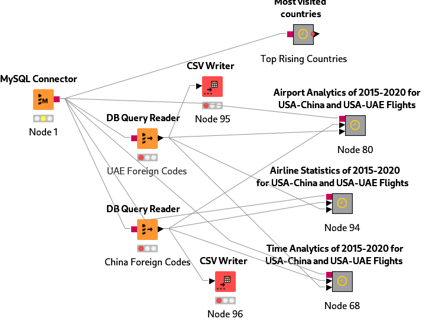
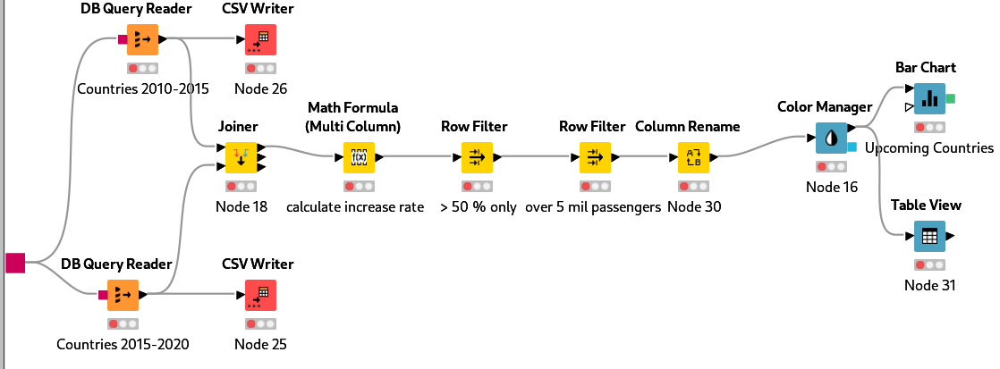
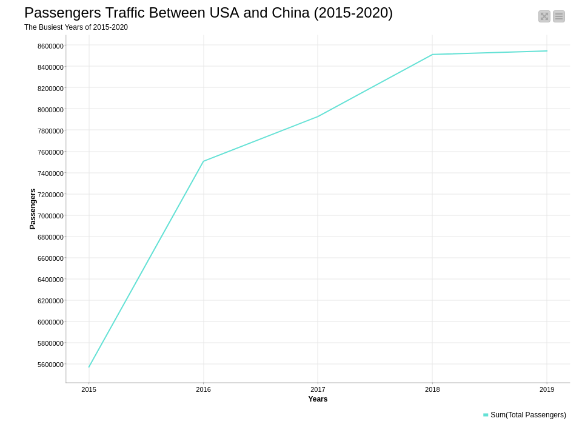
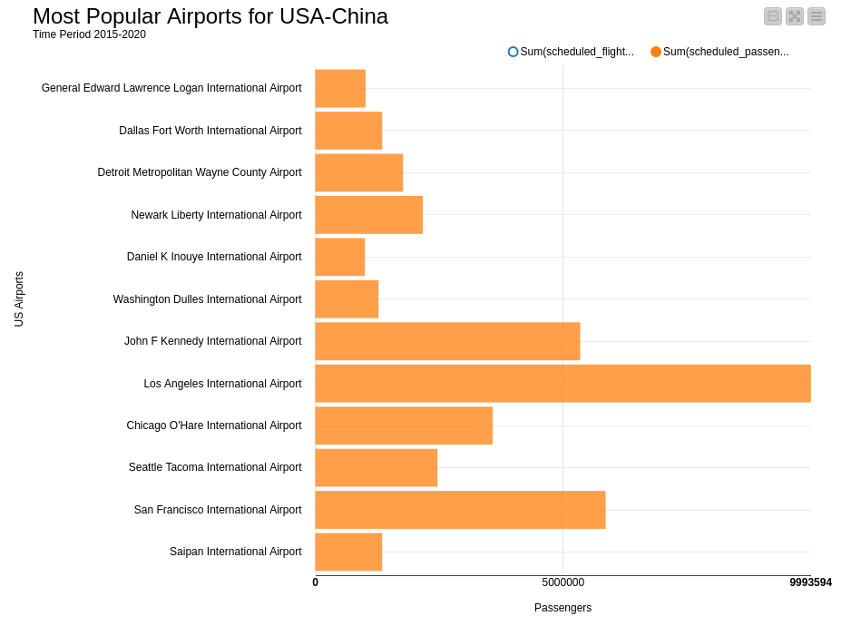

# US International Air Traffic Data Analysis

## Introduction

This project uses US international air traffic data from Kaggle to perform a data analysis and answer some business-related questions about the air travel industry. The data contains detailed information about flights, including the date of the flight, departure and arrival airports, airline carrier, and number of passengers on board. In addition to the main dataset, we also used several other helpful files to create dimensions and enrich the data. By leveraging the power of MySQL database and Knime data analytics platform, we aim to gain valuable insights and uncover trends and patterns that can inform business decisions.

You can find the dataset here: https://www.kaggle.com/datasets/parulpandey/us-international-air-traffic-data

## Setting up the MySQL Database and Importing Necessary Files

Before running the SQL scripts to create the dimensions and fact table, you'll need to set up a MySQL database and import the necessary CSV files.

Create a new database named `flights_db` in MySQL.
Import the following CSV files from the input directory into your MySQL database:

* **file_departures_csv**
* **file_passengers_csv**
* **file_airlines_csv**
* **file_airports_csv**
* **file_carrier_codes_csv**
* **file_countries_csv**

Make sure to import the files into appropriate tables with the aformentioned names.

## Creating Fact Table and Dimensions

To create the necessary dimensions and fact table for the flights data, the following scripts should be used:

**Flights_Raw**: 
This script creates a table that selects specific columns from the input data files `file_departures_csv` and `file_passengers_csv`, and joins them on matching values. This table contains information on the scheduled flights, carriers, and scheduled passengers.

**Time_Dimension**: This script creates a time dimension table that contains distinct date, year, and month values from the `Flights_Raw` table.

**Flights_Fact_Table**: This script creates a fact table that selects specific columns from the Flights_Raw table. This table contains information on the scheduled flights, carriers, and scheduled passengers, and is used to analyze the data.

**Airports_First_Form**: This script creates a temporary table that selects distinct airport codes from the `Flights_Raw` table, both from the `usg_apt` and `fg_apt` columns.

**Airports_Dimension**: This script creates an airport dimension table that joins the `Airports_First_Form` table with the `file_airports_csv` file on the matching `iata_code`. This table contains information on the airport locations and types.

**Airlines_First_Join**: This script creates a temporary table that selects distinct carrier and carrier group codes from the `Flights_Raw` table, and joins them with the `file_airlines_csv` file on the matching `iata` or `icao` codes. This table contains information on the airlines.

**Airlines_Dimension**: This script creates an airline dimension table that joins the `Airlines_First_Join` table with the `file_carrier_codes_csv` file on the matching code. This table contains information on the airlines, their names, and country codes.

These scripts create the necessary tables to analyze and visualize the flights data.

### The final Fact Table and Dimensions

* Flights Fact Table
* Airports Dimension
* Airlines Dimension
* Time Dimension

Additionally, with a little help from the `file_countries_csv` file, the data can be further analyzed and visualized by **country**.

## Data Analysis

To continue our analysis of the flights data, we will use Knime, a powerful data analytics platform. In this repository, we have included a Knime workflow file that connects to our MySQL database and runs queries on our tables.

The workflow file is designed to answer several key questions about the data. First, it investigates which countries had the biggest increase, comparing the time periods **2010-2015** and **2015-2020**. The results of the analysis show that **China** and the **UAE** had the largest increases in total flight passengers during these time periods.

The workflow then goes on to answer further questions about these two countries. Specifically, it examines how the increase in flights between 2015 and 2020 was distributed over time (monthly and yearly) for each country. Additionally, it investigates how this increase was distributed over US airports and airlines.

The results of these analyses are presented through bar charts and line plots, which are included in the Knime workflow. Overall, using Knime to analyze the flights data provides a powerful way to uncover insights and trends that would be difficult to see through manual analysis.

## Pictures

This section is a collection of screenshots and other images related to the project.

